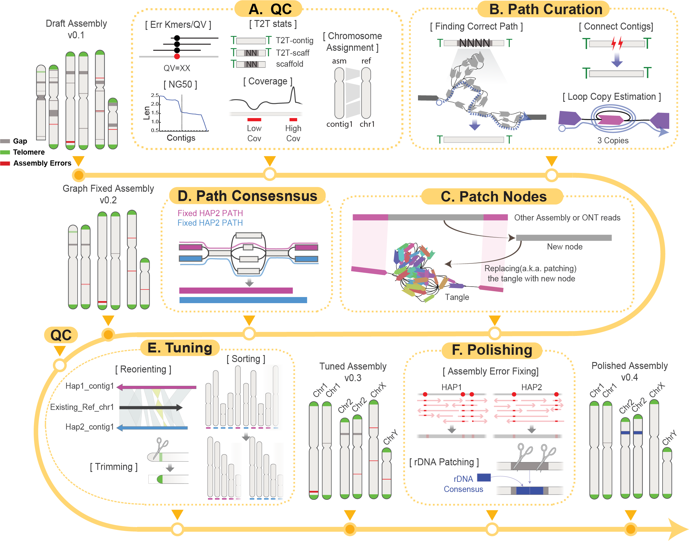

<h1 align="center">🐟 verkko-fillet</h1>

<p align="center">
  <em>Post-Verkko graph &amp; assembly cleaning, in Python.</em>
</p>

<p align="center">
  <a href="https://pypi.org/project/verkkofillet/"></a>
  <a href="LICENSE"></a>
  <a href="https://github.com/jjuhyunkim/verkko-fillet/issues"></a>
</p>

---

`verkko-fillet` is a Python toolkit for **cleaning, fixing, and gap-filling assemblies produced by the [Verkko](https://github.com/marbl/verkko) assembler**. It bridges the gap between a raw Verkko run and a polished, chromosome-assigned, T2T-ready consensus.

Designed to be used **interactively in Jupyter notebooks**, it provides everything needed to QC the graph, assign chromosomes, recover broken contigs, fill gaps, and emit a corrected GAF path file ready for a Verkko consensus (CNS) run.

## ✨ Highlights

- 🧬 **Quality control out of the box** — N50, completeness, contig length, T2T status, chromosome coverage, and T2T QC plots.
- 🗺️ **Chromosome assignment** — assign reference chromosomes and rename contigs based on a user-provided reference.
- 🧩 **Gap filling &amp; path repair** — detect, connect, and fill gaps and write back a fixed GAF for building new consensus.
- 🧪 **T2T QC** — detect internal telomeres for trimming, summarize per-contig telomere percentages at chromosome ends, and visualize them.
- 🔁 **Reproducible** — every step is recorded on the `VerkkoFillet` object with timestamp.


## Installation

📘 For a more detailed installation guide, see <https://verkko-fillet.readthedocs.io/en/latest/installation.html>.

`verkko-fillet` is on PyPI:

```bash
pip install verkkofillet
```

### External tool requirements

A few external binaries are expected on `$PATH` (or alongside the shipped scripts in `src/verkkofillet/bin/`):

- [`mashmap`](https://github.com/marbl/MashMap)
- [`samtools`](https://www.htslib.org/) (with `bgzip`)
- [`seqtk`](https://github.com/lh3/seqtk)

## Typical workflow

<p align="center">
  <br>
  <em>Figure 1. verkko-fillet pipeline overview.</em>
</p>

## 📚 Documentation

Full documentation is hosted on **Read the Docs**: <https://verkko-fillet.readthedocs.io/>

- [Installation](docs/installation.md)
- [Usage principles](docs/usage-principles.md)
- [Tutorials](docs/tutorials/index.md)
  - [Automatic preprocessing](docs/tutorials/basics/auto_preprocessing.md)
  - [Verkko QC](docs/tutorials/basics/verkkoQC.ipynb)
  - [Recovering T2T contigs](docs/tutorials/basics/telo.ipynb)
  - [Running Verkko consensus from a fixed path](docs/tutorials/basics/how_to_run_verkko_cns.md)
- [API reference](docs/api/index.md)
- [Release notes](docs/release-notes/index.md)

## What's new

See the [News](docs/news.md) page and the [Release notes](docs/release-notes/index.md) for the latest changes.

## Citation

If you use `verkko-fillet` in your work, please cite this [paper](https://www.biorxiv.org/content/10.1101/2025.10.01.679366v3):

> Kim, J., Rosen, B. D., Fumagalli, S. E., Kuhn, K. L., Long, A., Schoenebeck, J. J., ... & Rhie, A. (2025). Finishing a complete giraffe genome from telomere to telomere with Verkko-Fillet. bioRxiv.


## Contributing

Issues and pull requests are welcome at <https://github.com/jjuhyunkim/verkko-fillet>.

## License

Released under the license described in [LICENSE](LICENSE).


