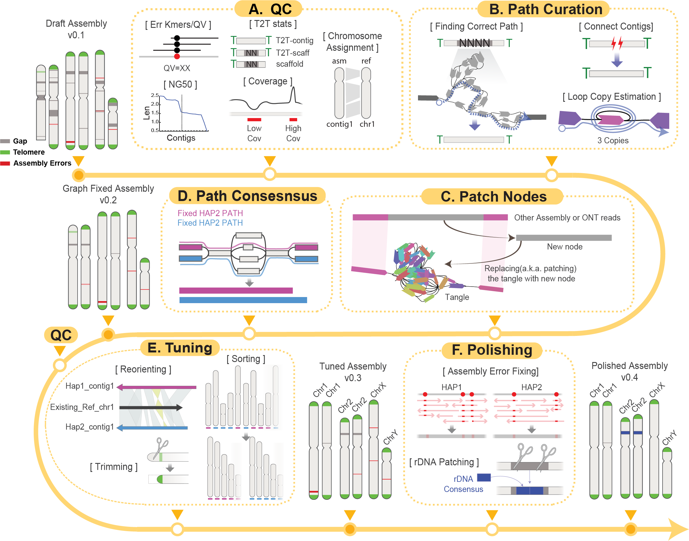

## Genome Assembly

### What is genome assembly
Genome assembly is the process of reconstructing an organism's complete DNA sequence from smaller fragments generated by sequencing technologies. This involves assembling millions to billions of short or long reads into a continuous representation of the genome.

### What can Verkko-Fillet do
There are many genome assembly methods available, but here we focus on using `verkko-fillet` to refine the results from the Verkko assembler. Verkko is a graph-based tool that generates consensus sequences by accurately connecting sequence nodes. However, during this process, some nodes may be misconnected, or certain nodes may remain unconnected when they should be. `verkko-fillet` helps users identify such problematic nodes and edges, gather supporting information, and correct the connections to enable a subsequent Verkko consensus run.

### Overall workflow

We start with the directories and files generated by the Verkko assembler. It is recommended to evaluate the quality of the assembly prior to path curation (Figure A). The core gap-filling function of Verkko-Fillet leverages ONT long-read alignments—specifically the ONT reads used in the initial assembly for scaffolding—mapped to the assembly graph with GraphAligner. Reads spanning the flanking nodes of unresolved gaps are identified and used to infer the correct traversal paths through the graph, enabling replacement of missing regions. This process includes copy number estimation of repeats within loops, reconnection of previously disconnected scaffolds (Figure B), and construction of new bridging nodes from sufficiently long ONT reads or long contigs generated by other assemblies (e.g., hifiasm) (Figure C). If a user wants to replace a tangled gap region with a sufficiently long sequence from ONT or another assembler (e.g., hifiasm), we provide a function that aligns the sequence to the region and replaces the tangle with a new node and path, rather than leaving it as a gap in the assembly. However, this approach should be used cautiously and only when there is high confidence in the accuracy of the patch sequence, as it alters the structure of the assembly graph. The new paths and nodes are subsequently used to regenerate consensus sequences (Figure D). Throughout the process, Verkko-Fillet supports exporting intermediate files in IGV- and BandageNG-compatible formats, facilitating simultaneous inspection of the assembly graph and sequence-level features.
The structurally refined assembly then undergoes tuning and polishing. The tuning step involves reorienting scaffolds according to known chromosomal orientation (if available), trimming, and sorting by chromosome or haplotype (Figure E). For species with no prior reference, Verkko-Fillet provides an option to sort the chromosomes by length and orient them based on user-provided centromere information. A finalized high-quality T2T assembly can then be generated by following the provided tutorial for base-level polishing using error k-mers and variant-calling methods (Figure F). rDNA regions are notoriously difficult to assemble due to their high copy number, so Verkko-Fillet includes a function to replace rDNA gaps with two copies of an rDNA consensus generated using Ribotin, ensuring representation of these regions in the final assembly (Figure F).

### What can't Verkko-Fillet do
The initial Verkko assembly should be generated before running Verkko-Fillet. We have provided the polishing workflow as well, either using DeepPolisher or using the provided pipeline, but it should be done by the user outside of Verkko-Fillet if they want to improve the base-pair resolution quality.

### Limitations
The majority of Verkko-Fillet functions utilize DataFrames, which run very fast and are lightweight, but there are several functions that use external tools, such as Meryl and GraphAligner, which we recommend running outside of the Jupyter notebook, as they are resource-intensive and time-consuming.
Also, Verkko-Fillet is a tool that helps users fix paths more easily. However, this does not mean that Verkko-Fillet can do everything automatically. All steps should be carefully done with manual inspection.